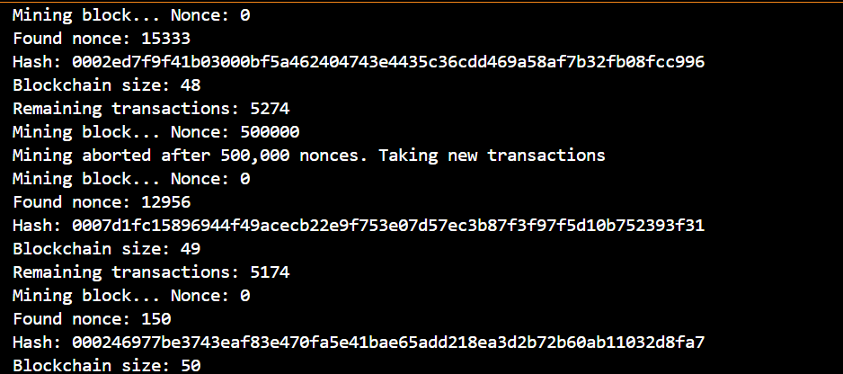
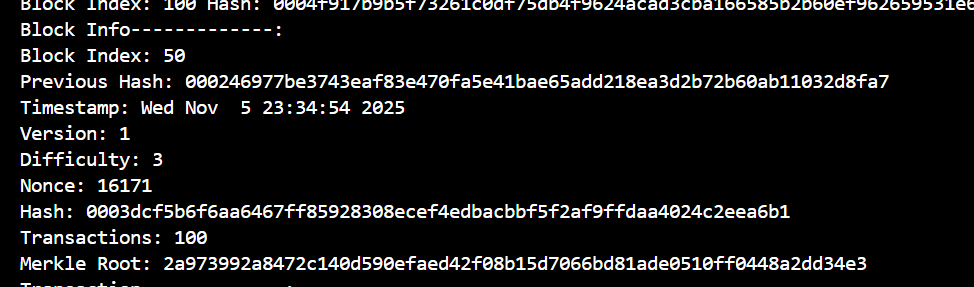

# Blockchain_Hashing

# 2-asis Darbas: Supaprastintos Blokų Grandinės (Blockchain) Kūrimas (v0.2)

Šiame projekte įgyvendinta supaprastinta blokų grandinės (Blockchain) imitacija. Grandinė naudoja sąskaitos modelį (*account model*) transakcijoms tvarkyti ir *Proof-of-Work* (PoW) mechanizmą naujų blokų kasimui.

## 1. Projekto Struktūra ir Klasės

| Failas | Klasė / Funkcija | Paskirtis |
| :--- | :--- | :--- |
| `user.h` | `User` | Vartotojo (naudotojo) duomenų struktūra (vardas, viešasis raktas, balansas). |
| `Transaction.h` | `Transaction` | Transakcijos duomenų struktūra (siuntėjas, gavėjas, suma, ID). |
| `Block.h` | `Block` | Bloko duomenų struktūra (antraštė ir transakcijos). |
| `Blockchain.h` | `Blockchain` | Blokų grandinės valdymas, blokų pridėjimas, prieiga prie paskutinio bloko. |
| `hash.h` | `hashing`, `salt` | Maišos funkcija, pritaikyta *Proof-of-Work* (PoW) reikalavimams. |
| `main.cpp` | `main` | Pagrindinė programa, inicijuojanti vartotojus, generuojanti transakcijas, kasanti ir pridedanti blokus. |

## 2. Versijos v0.1 Realizacija

Šie reikalavimai buvo įgyvendinti v0.1 versijoje:

* **Centralizuota grandinė:** Realizuota viena, centralizuota blokų grandinė.
* **Maišos funkcija:** Naudojama modifikuota, specialiai pritaikyta maišos funkcija (failas `hash.h`), galinti sugeneruoti maišos reikšmę, prasidedančią nurodytu skaičiumi nulių (pvz., `000...`).
* **Vartotojų generavimas:** Sukuriama ~1000 `User` objektų su atsitiktiniais balansais (nuo 100 iki 1 000 000).
* **Transakcijų generavimas:** Sukuriama ~10 000 `Transaction` objektų. Transakcijos ID yra maišos reikšmė, sugeneruota iš kitų transakcijos laukų (`kiekis` + `siuntėjas` + `gavėjas`).
* **Vizualumas:** Visi pagrindiniai procesai (vartotojų generavimas, transakcijos, blokų kasimas, grandinės būsena) yra išvedami į konsolę ir, kur reikia, į atitinkamus tekstinius failus (`users.txt`, `transactions.txt`, `blockchain.txt`).

## 3. Versijos v0.2 Realizacija (Patobulinimai)

Šie patobulinimai atitinka v0.2 versijos reikalavimus:

### 3.1. Merkle Medis ir Merkle Root Hash

* **Realizacija:** Implementuotas **Merkle Medis** (Merkle Tree) transakcijų tvirtinimui.
* **Funkcija:** Funkcija `computeMerkleRoot(const std::vector<Transaction>& txs)` apskaičiuoja Merkle šaknies (Root Hash) reikšmę.
    * Tai atliekama nuosekliai maišant gretimų transakcijų ID ir naujai gautas maišos reikšmes, kol lieka viena šaknies maišos reikšmė.
    * Nelyginiu atveju paskutinis maišos rezultatas maišomas su savimi (dubliuojamas).
* **Bloke:** `merkleRoot` laukas dabar saugo tikrą Merkle Root Hash, apskaičiuotą iš bloko transakcijų sąrašo (`Block.h`).

### 3.2. Transakcijų Verifikacija

* **Funkcija:** Sukurta funkcija `VerifyTransactions(vector<Transaction>& transactions, vector<User>& users)` (failas `Transaction.h`), kuri atlieka transakcijų tikrinimą prieš jas įtraukiant į patvirtintų (Verified) sąrašą ir atnaujinant vartotojų balansus.
* **Balanso Tikrinimas:** Tikrinama, ar siuntėjas turi pakankamą likutį transakcijai atlikti. Transakcijos su nepakankamu balansu atmetamos.
* **Transakcijos ID Tikrinimas:** Tikrinama, ar transakcijos ID (maišos reikšmė) yra teisingai sugeneruota iš transakcijos duomenų (`kiekis`, `siuntėjas`, `gavėjas`). Neteisingi ID atmetami.
* **Balanso Atnaujinimas:** Tik patvirtintos transakcijos atnaujina vartotojų balansus (`sender->changeBalance(-amount)` ir `receiver->changeBalance(+amount)`).

### 3.3. Kasimo Procesas (*Proof-of-Work*)

* **Sudėtingumo Lygis:** Naudojamas pastovus sudėtingumo lygis (`difficulty = 3`), reikalaujantis, kad bloko maišos reikšmė prasidėtų trimis nuliais (`000...`).
* **Header Hashing:** Maišomas bloką apibūdinančių elementų rinkinys, kuris apima: `previousHash`, `timestamp`, `version`, visų transakcijų maišą, `difficulty`, `merkleRoot` ir `nonce`.
* **Imituojamas Kasimo Apribojimas:**
    * Kadangi PoW gali užtrukti, kasimas yra ribojamas iki 500000 *nonce* iteracijų (`limit`).
    * Jei per šį limitą blokas neiškasamas, kasimas **abortuojamas**, o transakcijos grąžinamos į sąrašą.
    * Jei abortas įvyksta 5 kartus iš eilės, `limit` padidinamas per 500000, taip imituojant sudėtingumo didinimą, siekiant rasti bloką.
    * Šis metodas leidžia įvertinti maišos funkcijos efektyvumą ir *nonce* iteracijų skaičių sėkmingam kasimui.

## 4. Demonstracija (Konsolės Išvestis)

Paleidus programą, konsolėje matomi šie žingsniai (išvesties kokybė ir vizualumas buvo svarbūs vertinimo kriterijai ):

1.  **Vartotojų Išvestis:** Išvedami sugeneruoti vartotojai (pvz., 50), jų raktai ir pradiniai balansai.
2.  **Transakcijų Išvestis:** Išvedamos sugeneruotos transakcijos (pvz., 100), jų siuntėjai, gavėjai, sumos ir ID.
3.  **Kasimo Procesas:** Kiekvieno bloko kasimo metu rodomas *nonce* progresas (pvz., kas 100000 iteracijų) ir pranešimas apie sėkmingai rastą *nonce* ir galutinę bloko maišos reikšmę.
4.  **Blokų Pridėjimas:** Išvedama grandinės būsena po kiekvieno bloko pridėjimo: *Blockchain size* ir *Remaining transactions*.
5.  **Galutinė Grandinė:** Išvedama visa blokų grandinė, nurodant bloko indeksą ir maišos reikšmę.
6.  **Pavyzdžiai:** Išvedami pavyzdžiai (pvz., 50-asis blokas ir 10-oji transakcija 50-ajame bloke), demonstruojant duomenų struktūrų vientisumą4.
7.  **Galutinis Balansas:** Išvedami atnaujinti vartotojų balansai.

### Pavyzdys: Sėkmingai Iškasto Bloko Išvestis

### Pavyzdys: 50-asis Blokas

## 5. Panaudota AI Pagalba

Kuriant šį projektą, dirbtinio intelekto (AI) pagalba buvo pasitelkta šiems tikslams:

* **Maišos Funkcijos Tobulinimas:** Patarimai dėl maišos funkcijos (`hashing` faile `hash.h`) patobulinimo, kad ji veiktų deterministiškai ir efektyviai ieškotų reikiamos pradžios PoW mechanizme. Siekta padidinti maišos kokybę (pasklidimą).
* **Merkle Medžio Logika:** Konsultacijos dėl Merkle medžio algoritminės logikos ir kraštutinių atvejų (nelyginis transakcijų skaičius) apdorojimo funkcijoje `computeMerkleRoot`.
* **README Failo Sudarymas:** Pagalba formuojant šį README.md failą, užtikrinant, kad jame būtų aiškiai ir tvarkingai pateikti visi reikalaujami užduoties aspektai.